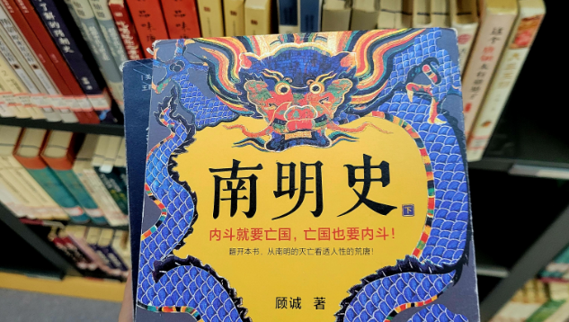

历史书如同一面哈哈镜，常常放大特定利益阶层的功绩，却忽视或淡化了平凡人的力量与贡献。
<!-- truncate -->

从《活着》中的普通人到李自成的大顺军，一再证明，平凡个体同样可以成就伟大。明代初年，名将多出自淮西，但若将他们置于一个稳定的时代，他们或许只是普通的农民或奴隶；若将他们放在不同的阵营，他们可能只是他人辉煌的背景。我们通常将伟大定义为时代赋予的成功与名声，但这种定义或许过于狭隘。伟大不应仅限于功成名就，而应更加包容和务实，更贴近人类共同的经验。勇敢、智慧，甚至失败，都值得被赋予伟大的意义。伟大存在于每个个体为生存、理想和信念所付出的努力中，无论成败。