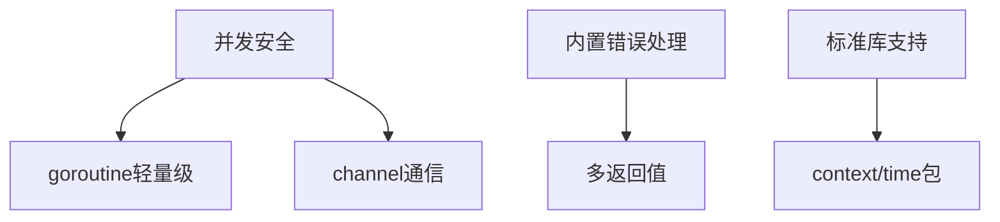
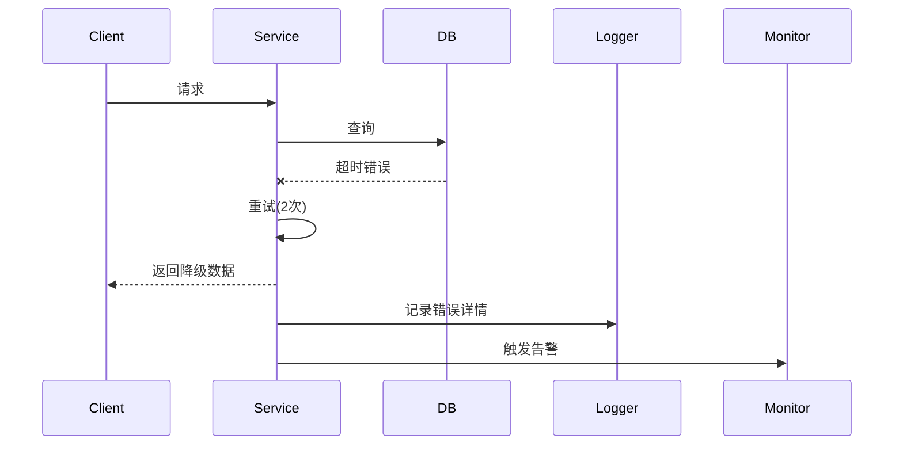

# 系统可靠性设计

## 1. 核心概念

### 1.1 定义

系统可靠性（Reliability）指系统在规定条件和时间内，**持续提供正确服务的能力**。一个真正高可用的系统，应具备以下能力：

- **失败可恢复**：遇到故障能快速自我修复或降级；
- **状态可控**：系统运行状态可被观测和控制；
- **资源可回收**：出现问题时不会造成资源泄漏或耗尽。

常用可靠性指标如下：

- **服务连续性**：MTBF（平均无故障时间） ≥ 99.9%
- **数据完整性**：数据错误率 < 0.001%
- **故障恢复能力**：MTTR（平均修复时间） ≤ 5分钟

### 1.2 设计原则

1. **失败可恢复（Fail Recovery）**
   系统应该能捕获错误，并做出适当处理或降级，不应直接 panic 或崩溃。
2. **超时与重试（Timeout & Retry）**
   每一次请求应设置超时机制，超时后应有重试策略，并考虑幂等性。
3. **资源可控（Resource Bound）**
   限制 goroutine、channel、内存、连接等资源，防止资源泄漏和耗尽。
4. **幂等性设计（Idempotency）**
   重试不能引发副作用，应确保接口或操作幂等。
5. **观察与告警（Observability）**
   系统内部应具备日志、指标、trace 等手段，便于排障。

### 1.3 可靠性设计方法

| 关键点   | 说明                              | 推荐工具/库                             |
| -------- | --------------------------------- | --------------------------------------- |
| 限制资源 | 控制 goroutine、channel、连接数等 | 使用缓冲、信号量、连接池等方式          |
| 明确超时 | 网络/IO 操作必须设置超时          | `context.WithTimeout`、`avast/retry-go` |
| 错误恢复 | 所有错误需捕获处理，避免 panic    | 明确错误类型和恢复策略                  |
| 可观测性 | 日志 + 指标 + Trace               | `prometheus`、`zap`、`pprof`、`otel`    |
| 可退出性 | goroutine 应可被安全终止          | 使用 `channel + select` 控制            |

### 1.4 Golang 可靠性优势



## 2. 实践指南

### 2.1 错误处理

#### 2.1.1 错误捕获和传递

```go
// 永远忽略错误 = 埋下定时炸弹
func ReadConfig(path string) (*Config, error) {
    data, err := os.ReadFile(path)
    if err != nil {
        // 追加上下文信息向上传递
        return nil, fmt.Errorf("read config failed: %w", err)
    }
    var cfg Config
    if err := json.Unmarshal(data, &cfg); err != nil {
        return nil, fmt.Errorf("parse config failed: %w", err)
    }
    return &cfg, nil
}

// 调用方必须处理错误
cfg, err := ReadConfig("config.json")
if err != nil {
    log.Fatalf("Fatal error: %v", err) // 或优雅降级
}
```

#### 2.1.2 错误包装与分类
```go
type BusinessError struct {
    Code    int
    Message string
    Cause   error
}

func (e *BusinessError) Error() string {
    return fmt.Sprintf("code=%d, msg=%s, cause=%v", e.Code, e.Message, e.Cause)
}

// 使用示例
func ProcessOrder() error {
    if err := validate(); err != nil {
        return &BusinessError{
            Code:    40001,
            Message: "invalid order",
            Cause:   err,
        }
    }
    // ...
}
```

#### 2.1.3 错误恢复策略矩阵
| 错误类型     | 恢复策略      | Golang实现示例           |
| ------------ | ------------- | ------------------------ |
| 临时性错误   | 重试+退避策略 | `retry-go`库+`context`   |
| 业务逻辑错误 | 熔断降级      | `gobreaker`熔断器        |
| 资源不足错误 | 自动扩容+限流 | `golang.org/x/time/rate` |

**重试机制+backoff策略**

```go
func Retry(attempts int, sleep time.Duration, fn func() error) error {
	for i := 0; i < attempts; i++ {
		if err := fn(); err != nil {
			log.Printf("attempt %d failed: %v", i+1, err)
			time.Sleep(sleep)
			sleep *= 2
		} else {
			return nil
		}
	}
	return fmt.Errorf("all attempts failed")
}

// 调用示例：
err := Retry(3, 100*time.Millisecond, func() error {
	// your logic here
	return errors.New("simulate failure")
})
```


### 2.2 资源管理

#### 2.2.1 确保资源释放

```go
func ProcessFile(path string) error {
    file, err := os.Open(path)
    if err != nil {
        return err
    }
    defer file.Close() // 无论函数如何退出都会执行

    scanner := bufio.NewScanner(file)
    for scanner.Scan() {
        // 处理数据
    }
    return scanner.Err() // 返回扫描错误
}
```

#### 2.2.2 防止goroutine 泄露

```go
// 退出信号 + select 控制
func worker(stop <-chan struct{}) {
	ticker := time.NewTicker(time.Second)
	defer ticker.Stop()

	for {
		select {
		case <-ticker.C:
			log.Println("working...")
		case <-stop:
			log.Println("worker stopped")
			return
		}
	}
}

// 调用方式：
stopCh := make(chan struct{})
go worker(stopCh)
time.Sleep(5 * time.Second)
close(stopCh)
```

#### 2.2.3 连接池配置模板

```go
// Database连接池配置
db, err := sql.Open("mysql", dsn)
db.SetMaxOpenConns(25)          // 最大连接数
db.SetMaxIdleConns(5)           // 空闲连接数
db.SetConnMaxLifetime(5*time.Minute) // 最大存活时间

// HTTP Client配置
transport := &http.Transport{
    MaxIdleConns:        100,
    IdleConnTimeout:     90 * time.Second,
    TLSHandshakeTimeout: 10 * time.Second,
}
client := &http.Client{
    Transport: transport,
    Timeout:   30 * time.Second, // 包括连接+传输+读取
}
```

#### 2.2.4 超时控制

通过`context.WithTimeout`实现

```go
func FetchData(ctx context.Context, url string) ([]byte, error) {
    req, _ := http.NewRequestWithContext(ctx, "GET", url, nil)
    resp, err := http.DefaultClient.Do(req)
    if err != nil {
        return nil, err
    }
    defer resp.Body.Close()
    return io.ReadAll(resp.Body)
}

// 调用方设置超时
ctx, cancel := context.WithTimeout(context.Background(), 3*time.Second)
defer cancel()
data, err := FetchData(ctx, "https://api.example.com")
```

> 防止任务阻塞

### 

#### 2.2.5 性能分析工具

- `pprof`
- `expvar`
- `go tool trace`

### 2.3 并发安全

`sync.Mutex` /`atomic`/`channel`

#### 2.3.1 锁机制与原子操作

```go
type SafeCounter struct {
    mu    sync.Mutex
    count int
}

func (c *SafeCounter) Increment() {
    c.mu.Lock()
    defer c.mu.Unlock() // defer 解锁确保异常安全
    c.count++
}

// 使用 sync/atomic 的无锁优化
var atomicCount int64
atomic.AddInt64(&atomicCount, 1) // 原子操作
```

> **检测工具**：`go run -race your_app.go`

#### 2.3.2 Worker Pool实现
```go
type Task func()

func NewWorkerPool(size int) chan Task {
    tasks := make(chan Task, size)
    for i := 0; i < size; i++ {
        go worker(tasks)
    }
    return tasks
}

func worker(tasks <-chan Task) {
    for task := range tasks {
        task()
    }
}

// 使用示例
pool := NewWorkerPool(10)
pool <- func() { /* 任务逻辑 */ }
```

### 2.4 防御性编程

#### 2.4.1 输入校验与早失败

```go
func ValidateInput(input UserInput) error {
    if input.Email == "" {
        // 存在错误，立刻返回
        return errors.New("email cannot be empty")
    }
    if !strings.Contains(input.Email, "@") {
        return errors.New("invalid email format")
    }
    if input.Age < 18 {
        return errors.New("age must be >= 18")
    }
    return nil
}

// 在入口处强制校验
err := ValidateInput(req.Data)
if err != nil {
    http.Error(w, err.Error(), http.StatusBadRequest)
    return
}
```

#### 2.4.2 健康检查与自检

```go
http.HandleFunc("/healthz", func(w http.ResponseWriter, r *http.Request) {
	w.WriteHeader(http.StatusOK)
	w.Write([]byte("ok"))
})
//  支持服务自检，可配合 k8s、ELB 实现健康探针。
```

#### 2.4.3 可观测性与日志埋点

```go
import (
    "go.uber.org/zap"
    "github.com/prometheus/client_golang/prometheus"
)

var (
    requestCounter = prometheus.NewCounterVec(
        prometheus.CounterOpts{
            Name: "api_requests_total",
            Help: "Total API requests",
        },
        []string{"method", "status"},
    )
    logger, _ = zap.NewProduction()
)

func HandleRequest(w http.ResponseWriter, r *http.Request) {
    start := time.Now()
    
    // 业务逻辑...
    
    latency := time.Since(start)
    requestCounter.WithLabelValues(r.Method, "200").Inc()
    logger.Info("request completed",
        zap.String("path", r.URL.Path),
        zap.Duration("latency", latency),
    )
}
```

### 2.5 异步通信 

#### 2.5.1 确认机制

```go
// 多服务确认
// payment/handler.go
func (p *PaymentService) HandlePay(ctx context.Context, msg OrderCreatedEvent) error {
	// ...处理支付逻辑...
	if success {
		return notifyAck("payment", msg.OrderID) // 显式确认
	} else {
		return errors.New("payment failed")
	}
}
// order/notify.go
func notifyAck(source, orderID string) error {
	return postJSON("http://order-service/ack", map[string]string{
		"source": source,
		"order_id": orderID,
	})
}
```

```go
// 多goroutine 确认
package main

import (
	"fmt"
	"time"
)

// EventAggregator manages a set of rules and processes updates through channels
type EventAggregator struct {
	rules         []string
	updateChannel chan *rulesUpdateRequest
	shutdownChan  chan struct{}
}

// rulesUpdateRequest represents a request to update the rules
type rulesUpdateRequest struct {
	newRules []string
	response chan error
}

// NewEventAggregator creates and starts a new EventAggregator
func NewEventAggregator() *EventAggregator {
	agg := &EventAggregator{
		rules:         []string{},
		updateChannel: make(chan *rulesUpdateRequest),
		shutdownChan:  make(chan struct{}),
	}
	
	go agg.processRequests()
	return agg
}

// UpdateRules safely updates the rules by sending a request through the channel
func (a *EventAggregator) UpdateRules(newRules []string) error {
	req := &rulesUpdateRequest{
		newRules: newRules,
		response: make(chan error, 1), // Buffered to avoid blocking
	}
	
	a.updateChannel <- req
	return <-req.response
}

// Shutdown gracefully stops the aggregator
func (a *EventAggregator) Shutdown() {
	close(a.shutdownChan)
}

// processRequests handles incoming requests in a thread-safe manner
func (a *EventAggregator) processRequests() {
	for {
		select {
		case req := <-a.updateChannel:
			a.rules = req.newRules
			fmt.Println("Updated rules:", a.rules)
			req.response <- nil
		case <-a.shutdownChan:
			fmt.Println("Shutting down aggregator")
			return
		}
	}
}

func main() {
	// Create and start the aggregator
	aggregator := NewEventAggregator()
	defer aggregator.Shutdown()

	// Simulate some updates
	go func() {
		time.Sleep(500 * time.Millisecond)
		if err := aggregator.UpdateRules([]string{"a", "b", "c"}); err != nil {
			fmt.Println("Error updating rules:", err)
		}
	}()

	go func() {
		time.Sleep(1 * time.Second)
		if err := aggregator.UpdateRules([]string{"d", "e", "f"}); err != nil {
			fmt.Println("Error updating rules:", err)
		}
	}()

	// Give time for the updates to process
	time.Sleep(2 * time.Second)
}
```

#### 2.5.2 通知机制/监听模式

```go
// inventory/consumer.go
func (s *InventoryService) OnPaymentSuccess(event PaymentSuccessEvent) {
	// 变更库存状态
	s.updateStock(event.OrderID)
	
	// 通知订单系统
	s.notifyStatus(event.OrderID, "inventory_updated")
}
```

### 2.6 单元测试与压力测试

#### 2.6.1 覆盖率验证可靠性

```go
// 单元测试 + 错误注入
func TestReadConfig_FileNotExist(t *testing.T) {
    _, err := ReadConfig("non_existent.json")
    if err == nil {
        t.Fatal("Expected error but got nil")
    }
    if !os.IsNotExist(err) {
        t.Errorf("Unexpected error: %v", err)
    }
}

// 压力测试
func BenchmarkConcurrentIncrement(b *testing.B) {
    counter := SafeCounter{}
    b.RunParallel(func(pb *testing.PB) {
        for pb.Next() {
            counter.Increment()
        }
    })
}
```

## 3. 故障演练方案

### 3.1 混沌工程测试矩阵
| 测试类型 | 实施工具                       | 验证指标             |
| -------- | ------------------------------ | -------------------- |
| 网络延迟 | `tc netem add delay`           | 超时重试机制是否生效 |
| 服务中断 | `kubectl delete pod`/`kill -9` | 服务自愈时间         |
| 内存泄漏 | `go tool pprof`                | 内存增长曲线         |
| 磁盘满   | `dd if=/dev/zero`              | 错误日志是否准确     |

### 3.2 典型故障处理流程


## 4. 生产环境检查清单

### 4.1 部署前必检项
- [ ] 所有网络调用设置超时（≤3s）
- [ ] 数据库连接池已正确配置
- [ ] 关键路径错误日志已埋点
- [ ] 接入监控系统（如 Prometheus）
- [ ] Goroutine泄漏测试通过

### 4.2 运行时监控关键指标
```bash
# 监控命令示例
go tool pprof http://localhost:6060/debug/pprof/goroutine
curl -s http://localhost:9090/metrics | grep api_requests_total
journalctl -u myapp -f | grep "ERROR"
```

## 5. 推荐工具链增强

### 5.1 可靠性增强工具包
```go
import (
    "github.com/avast/retry-go"          // 重试策略
    "github.com/sony/gobreaker"          // 熔断器
    "golang.org/x/time/rate"             // 限流器
    "go.uber.org/goleak"                // Goroutine泄漏检测
    "github.com/fortytw2/leaktest"       // 内存泄漏检测
)
```

### 5.2 典型配置示例
```go
// 熔断器配置
cb := gobreaker.NewCircuitBreaker(gobreaker.Settings{
    Name:        "API_CALL",
    MaxRequests: 5,
    Interval:    10 * time.Second,
    Timeout:     30 * time.Second,
})

// 限流器配置
limiter := rate.NewLimiter(rate.Every(100*time.Millisecond), 10)
```

## 6. 附录：可靠性设计模式速查表

| 场景           | 模式          | 实现示例                      |
| -------------- | ------------- | ----------------------------- |
| 批量操作       | 分片处理+并行 | `errgroup` + `sync.WaitGroup` |
| 第三方服务调用 | 熔断+降级     | `gobreaker` + 本地缓存        |
| 数据处理管道   | 有界队列+背压 | `buffered channel` + `select` |
| 定时任务       | 分布式锁+幂等 | `redislock` + 任务ID去重      |
| 配置热更新     | 原子指针交换  | `atomic.Value` + `fsnotify`   |

