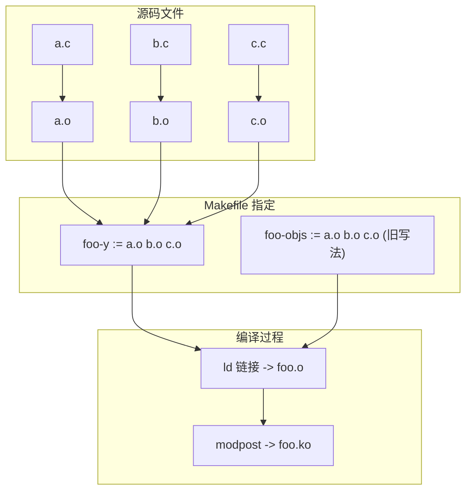
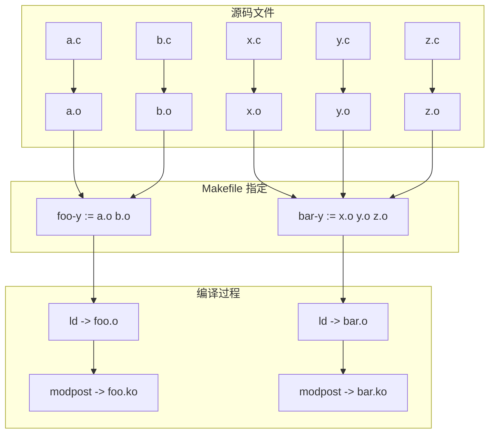

# Kernel Module Makefile: -y vs -objs

在 Linux 内核模块的 `Makefile` 中，经常会看到如下写法：

- `xxx-y`
- `xxx-objs`

它们都用于指定 **组成某个模块的对象文件列表**。

------

## 1. 区别说明

### `xxx-y`

- **推荐的写法**。

- 用于指定 `xxx.o` 由哪些 `.o` 文件组成。

- 常见用法：

  ```makefile
  obj-m += foo.o
  foo-y := a.o b.o c.o
  ```

  编译后会生成：

  - `a.o b.o c.o`
  - 链接成 `foo.o`
  - 最终 `foo.ko`

------

### `xxx-objs`

- **旧写法**，作用与 `xxx-y` 完全等价。

- 常见用法：

  ```makefile
  obj-m += foo.o
  foo-objs := a.o b.o c.o
  ```

------

## 2. 单模块编译流程

下面用 `foo.ko` 为例说明构建流程：



------

## 3. 多模块编译流程

当 `Makefile` 中有多个模块时，例如：

```makefile
obj-m += foo.o
obj-m += bar.o

foo-y := a.o b.o
bar-y := x.o y.o z.o
```

对应的流程如下：



------

## 4. 总结

1. **`xxx-y` 是推荐用法**，用于指定一个模块由哪些对象文件组成。
2. **`xxx-objs` 是旧写法**，作用和 `-y` 完全相同。
3. 编译流程大致为：
   - `.c → .o`（gcc 编译）
   - `.o → xxx.o`（ld 链接，根据 `xxx-y` / `xxx-objs`）
   - `xxx.o → xxx.ko`（modpost 生成内核模块）
4. `obj-m += xxx.o` 用于告诉内核编译系统最终需要生成一个 `xxx.ko` 模块。
