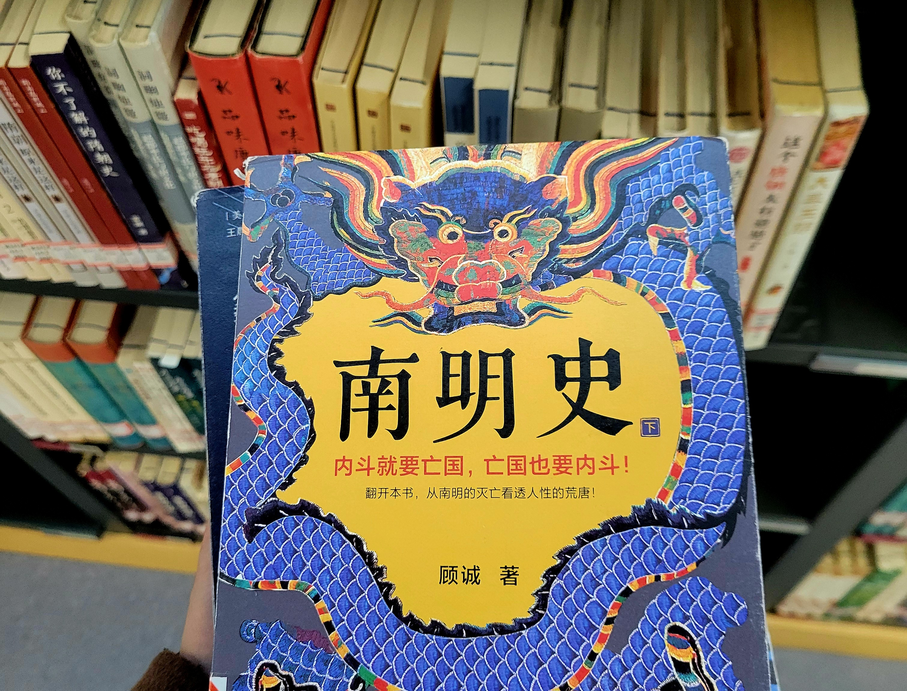

History books are like funhouse mirrors, often magnifying the achievements of specific interest groups while overlooking or downplaying the power and contributions of ordinary people.

<!-- truncate -->
From the ordinary people in "To Live" to Li Zicheng's Dashun Army, it repeatedly proves that ordinary individuals can also achieve greatness. In the early Ming Dynasty, many famous generals came from Huaixi, but if they were placed in a stable era, they might just be ordinary farmers or slaves; if they were placed in different camps, they might just be the background of others' glory. We usually define greatness as the success and fame bestowed by the times, but this definition might be too narrow. Greatness should not be limited to fame and success, but should be more inclusive and practical, closer to common human experience. Courage, wisdom, and even failure all deserve to be endowed with the meaning of greatness. Greatness exists in every individual's efforts for survival, ideals, and beliefs, regardless of success or failure. 