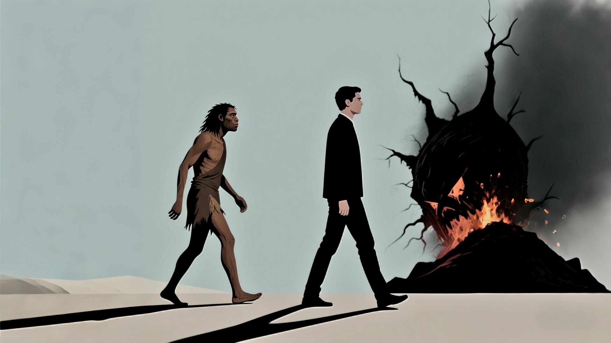

'A Brief History of Humankind' provides a comprehensive overview of culture, religion, society, and other diverse fields. While it may lack professional depth, it offers valuable perspectives for understanding 'human society'.

<!-- truncate -->

## Justice
1. The opening of the Age of Discovery allowed Spain and Portugal to become prosperous first. However, the good times didn't last long, as the Netherlands later surpassed them. A key factor was their judicial independence. The Netherlands valued and protected individual rights, especially private property, while authoritarian regimes often lacked such guarantees. This caused capital and wealth to naturally flow to regions that could provide better security and stability, thus driving the rise of the Netherlands.
2. Freedom and equality are the most basic values, but there is an inherent contradiction between the two. To achieve equality, it is necessary to restrict the freedom of some people; if everyone enjoys absolute freedom, society will inevitably move toward inequality. Therefore, real-world systems often seek balance between the two rather than pursuing one extreme.

## Culture
1. The culture of small states and few people is not a deliberately designed exploitation tool by certain individuals, but a product of historical coincidence, a conceptual system that parasitizes and reproduces in human psychology. Successful cultures, like humans and wheat, are good at self-replication and spread. However, the success of culture does not mean it is beneficial to humans—prosperous culture is not necessarily good culture, and success does not equal superiority.

## Economy
1. For most people, economic development has indeed improved their lives, making them happier than their ancestors. However, this is not absolute. Even if the collective economic pie is larger, if distribution is unfair, some people will still be in trouble. The migratory and gathering life of primitive Homo sapiens may not have been difficult, but after the agricultural revolution, humans began to live in groups, and the resulting rule and oppression gradually emerged. The industrial revolution improved overall living standards but also exacerbated wealth inequality.
2. Economic bubbles refer to the phenomenon where virtual capital (such as stocks, real estate) prices far exceed their actual value, seriously detached from the real economy. It stems from human greed and capitalist market mechanisms, while also being built on people's belief in a continuously improving future. Over the past two hundred years, armed plunder and industrial development have given investors a blind confidence, firmly believing that the economy will continue to prosper. However, industrial technological progress is not linear but similar to step-like development—experiencing a period of stability before leaping again. When the economy enters a stable period and the expected high-speed growth fails to materialize, bubbles arise, as if overdrafting the future. Perhaps only rapidly advancing technological progress can alleviate this dilemma.
3. The rapid development of modern technology is inseparable from capitalism. Capital seeks profit, and technological leadership often means higher returns. In this mutually reinforcing relationship, capital drives technological progress, and technology in turn helps capital growth, both jointly shaping the high-speed development of modern society.
4. Enabling ordinary people to live healthy and prosperous lives should be one of the supreme goods that sages pursue. From this perspective, capitalism seems to play the role of a "sage" and is even regarded as the only "truth." Under such logic, wealth not only means material abundance but even becomes a symbol of morality.
5. The foundation of modern wealth lies in people's instinctive drive to increase personal wealth. It is this selfish motivation that drives market competition and innovation, and greed becomes an important catalyst for economic growth to some extent.

## Family
1. Family relationships are quite complex. In ancient times, most marriages were arranged by parents, with matchmakers' words determining a lifetime. Children had almost no autonomy over their own marriage and life, which is quite lamentable. Today, the situation is very different. Parents can still influence their children's lives, but children have more autonomy, and the right to choose their own life is in their own hands. Others' opinions are just suggestions. However, when life encounters setbacks, children often still blame their parents, which is quite ironic. 